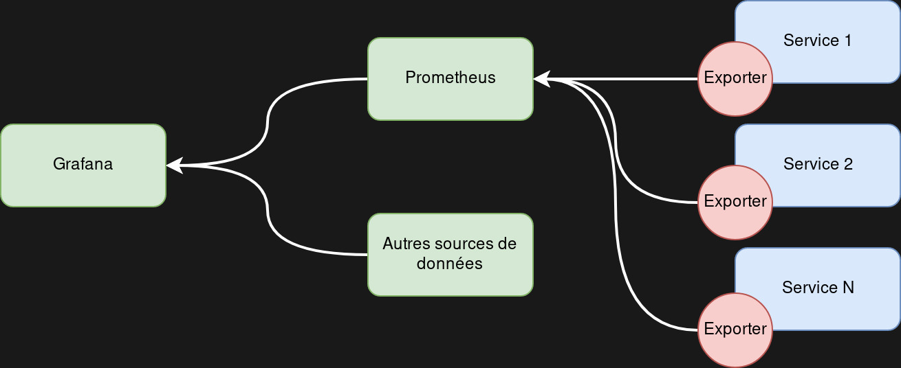
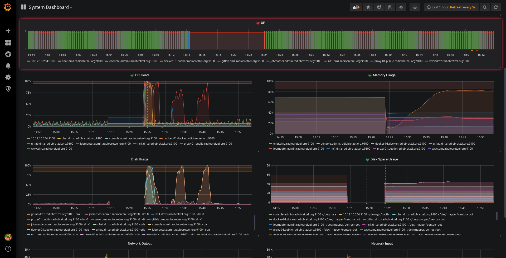
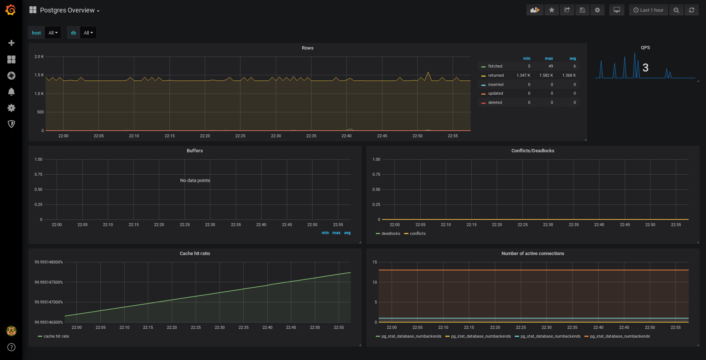
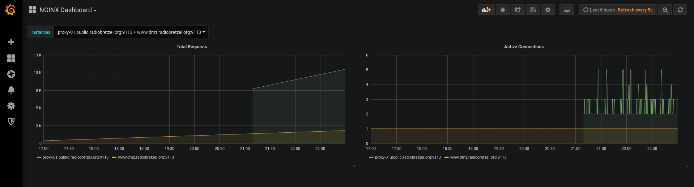

# Projet Supervision Ingésup M1 (2018-2019)

Auteurs :

- Clément RUIZ
- Victor MIGNOT

---

Dans ce document, nous décrirons dans un premier temps nos plateformes de développement et leurs services, puis nous exposerons les solutions de surveillance et d'alerting choisies et mises en place, et enfin présenterons quelques exemples de visualisation des données de supervision.

## Table des matières

1. [Infrastructure Monitorée](#1)
    1. [Présentation de Radio Bretzel](#1-a)
    2. [Description technique de l'infrastructure](#1-b)
2. [Plateforme de surveillance](#2)
    1. [Présentation technique](#2-a)
    2. [Solution de Supervision](#2-b)
3. [Implémentation de la solution de surveillance](#3)
    1. [Choix des métriques](#3-a)
    2. [Outils de collecte](#3-b)
    3. [Alerting](#3-c)
        1. [Seuils systèmes communs](#3-c-1)
        2. [Métriques liées aux services](#3-c-2)
        3. [Seuils liés à surveillance du réseau](#3-c-3)
        4. [Implémentation de l'alerting](#3-c-4)
4. [Visualisation des données](#4)
    1. [Exemples de dashboards](#4-a)
5. [Limites de la solution et expériences personnelles](#5)
    1. [Limites de la stack Prometheus / Grafana](#5-a)
    2. [Expériences personnelles](#5-b)
        1. [Victor MIGNOT](#5-a-1)
        2. [Clément RUIZ](#5-a-2)

## Infrastructure monitorée 

### Présentation de Radio Bretzel 

L'infrastructure que nous avons choisi d'utiliser pour cet exercice est celle de la plateforme de développement de [Radio Bretzel](https://www.radiobretzel.org), un projet libre d'application de webradios collaboratives.

Pour commencer, toute la plateforme est accessible depuis internet *via* le nom de domaine **radiobretzel.org** ([lien whois](https://www.whois.com/whois/radiobretzel.org)).  
Si la disponibilité de sa plateforme est appréciable, **l'essentiel du projet Radio Bretzel repose sur l'intégrité de son code et de sa documentation.** Ces éléments, ainsi qu'une partie de la configuration de la plateforme sont versionnés et gérés à travers une instance Gitlab, accessible via l'URL https://source.radiobretzel.org. Ce service est composé de l'application `gitlab`, de son serveur de base de données `postgresql`, et il est placé derrière un reverse proxy qui s'occupe de la terminaison SSL. Aussi, Gitlab fait appel à un `gitlab-runner` comme outil de CI/CD, qui permet d'automatiser une partie du cycle de vie de l'application `radiobretzel`. Il fournit également le registre docker pour les projets qu'il héberge.

Gitlab est accompagné d'une instance `mattermost` pour qui il sert de serveur d'authentification, et dans lequel il publie des messages relatifs aux pipelines de CI/CD et à la création d'*issues*. Elle est accessible via <https://chat.radiobretzel.org> et se constitue du service `mattermost`, de sa base de données `postgresql` ; il est lui aussi placé derrière le reverse proxy.

D'autre part, un site web vitrine sert de page d'accueil pour les robots et les éventuels touristes qui découvrent le projet. Il est accessible via <https://www.radiobretzel.org> et n'est constitué que d'une seule page html statique hébergée sur un serveur `nginx`, toujours derrière notre reverse proxy.

Pour s'assurer de l'intégrité des données, un mécanisme de sauvegarde a été mis en place, il est lancé depuis une machine d'administration. Il réalise un export des données des différents services, et les exporte vers une machine tierce, hors plateforme. Cette machine est une raspberry, utilisant Raspbian et accessible en SSH via le nom de domaine **papybretzel.ddns.net**.

Enfin, un serveur OpenVPN destiné à l'administration de la plateforme est accessible depuis internet via le nom de domaine **vpn.radiobretzel.org**.

### Description technique de l'infrastructure 

La plateforme de Radio Bretzel est hébergée sur un seul serveur physique loué chez **Online.net** par Clément RUIZ. La gestion du réseau n'est pas assurée par Proxmox, la solution d'orchestration de VM installée sur la machine hôte. Elle est déléguée à une instance OpnSense (fork de pfSense), qui assure le lien avec internet, ainsi que le routage et filtrage L3/L4 entre les différents sous-réseaux :

- **10.12.10.0/24** -> ADMIN. Réseau de management interne de la plateforme Radio Bretzel. Accessible en interne via le sous-domaine **admin.radiobretzel.org**
- **10.12.20.0/24** -> DMZ_INT. DMZ interne hébergeant les différents services de Radio Bretzel. Accessible en interne via le sous-domaine **dmz.radiobretzel.org**
- **10.12.30.0/24** -> DMZ_PUB. DMZ externe, hébergeant le reverse proxy. Accessible en interne via le sous-domaine **public.radiobretzel.org**
- **10.12.40.0/24** -> DOCKER. DMZ dédiée à faire tourner des hôtes dockers contrôlés par des gitlab-runners. Accessible en interne par le sous-domaine **docker.radiobretzel.org**
- **10.12.12.0/24** -> VPN_SSL. Réseau de clients VPN SSL OpenVPN. Le serveur est hébergé directement sur l'OpnSense et permet l'administration à distance de la plateforme.

Ces réseaux comprennent un ensemble de machines virtuelles :

- **jobmaster.admin.radiobretzel.org** : Machine de pilotage, responsable des processus de backup et de déploiement de configuration (Ansible)
- **console.admin.radiobretzel.org** : Accès à Proxmox (hyperviseur), soit la machine physique, depuis le réseau interne.
- **fw.admin.radiobretzel.org** : Le firewall OpnSense en charge du routage et du filtrage réseau de la plateforme, ainsi que de l'accès VPN
- **ns1.dmz.radiobretzel.org** : Serveur DNS interne
- **www.dmz.radiobretzel.org** : Serveur web. Site statique (HTML/CSS only)
- **gitlab.dmz.radiobretzel.org** : Instance gitlab (installée via omnibus). Accessible depuis le net <https://source.radiobretzel.org>. Héberge également un registre docker (<https://registry.radiobretzel.org>)
- **chat.dmz.radiobretzel.org** : Instance Mattermost câblée via oAuth à Gitlab (installée via le gitlab omnibus). (<https://chat.radiobretzel.org)>
- **proxy-01.public.radiobretzel.org** : HTTP Reverse Proxy utilisant nginx. S'occupe de la terminaison SSL pour les services accessibles depuis le web (Let's Encrypt)

## Plateforme de surveillance 

### Présentation technique 

La plateforme de monitoring est externe, et a été montée pour l'occasion. Elle est, comme pour Radio Bretzel, entièrement virtualisée et hébergée sur un seul serveur physique dans le Cloud. Elle ne contient qu'un seul réseau, **192.168.10.0/24**, et qu'un seul hôte, hébergeant le service de surveillance, de visualisation et d'alerte, accessible à l'IP `192.168.10.20`. Une instance de `pfSense` permet de d'encapsuler le trafic entre les 2 plateformes à travers internet via des tunnels IPSec :

- ADMIN     <-->  LAN
- DMZ_INT   <-->  LAN
- DMZ_PUB   <-->  LAN
- DOCKER    <-->  LAN
- VPN_SSL    -->  LAN (sens unique)

Aucun filtrage réseau particulier n'est effectué en vue de l'aspect temporaire de la solution et nos besoins de flexibilité pour ce TP.

### Solution de supervision 

Pour ce TP, nous avons voulu essayer la stack `Prometheus / Grafana`. Entièrement sous licence libre, elle se compose de 3 éléments indépendants :

- Les "**exporters**" sont des agents de collecte sur les hôtes à surveiller. Ces agents sont spécifiques au types de métriques recueillies. Par exemple, les données relatives au système de la machine seront traitées pas le module officiel fourni par Prometheus, `node_exporter`. Cependant, d'autres modules non-officiels existent pour des applications, par exemple `mysqld_exporter` pour des métriques relatives à une instance `mysql`. Une fois ces métriques collectées, elles sont exposées via HTTP (ou HTTPS) sur  [un port "réservé"](https://github.com/prometheus/prometheus/wiki/Default-port-allocations) en fonction du type d'_exporter_.

- **Prometheus Server**, l'outil de supervision en lui-même. Son rôle est d'agréger les données en requêtant les exporters renseignés dans sa configuration. Il intègre un service d'alerte, qui peut aussi être externalisé, et offre une API pour d'éventuels outils de visualisation.  
Il fournit  également un interpréteur de son propre langage de requête dynamique, `PromQL` et des opérations de traitements sont également possibles afin de générer des métriques dynamiques. (Ex : On récupère différentes informations sur la RAM, et on  calcule à la volée un pourcentage d'utilisation pour faciliter la lisibilité).  
Cependant, il ne permet pas directement de traiter les alertes chaînées et la gestion des tickets, comme pourrait le faire un Zabbix. Ces fonctionnalités peuvent néanmoins être externalisées facilement via l'utilisation du plugins, assez répandus en vue de la popularité croissante de cette solution.

- **Grafana**, l'outil de visualisation et dashboarding présentée sous forme d'interface web. Son principe est simple, il agrège des données via différents **data sources**, et les met en forme *via* différents types de graphiques définis par l'utilisateur. Nous utiliserons un plugin officiel de data source pour Grafana qui utilise `PromQL` pour récupérer les métriques que l'on souhaite mettre en forme sur un serveur `prometheus`. Le site officiel [grafana.com](https://grafana.com/dashboards) recense des centaines de dashboards créés par la communauté pour la plupart des systèmes, applications, et *exporters* officiels ou non-officiels.

## Implémentation de la solution de surveillance 

### Choix des métriques 

Pour toute machine, virtuelle comme physique, il est essentiel de surveiller les différentes métriques systèmes et matérielles comme :

- La charge CPU
- Le taux d'utilisation de la RAM
- L'espace disque disponible sur toutes les partitions
- Le taux d'occupation de la bande passante des cartes réseaux
- Le nombre de mises à jour système disponibles (de sécurité / logicielles)

Aussi, il est aussi intéressant de monitorer l'état, le nombre de requêtes par minute et d'erreurs levées, pour les différents services de la plateforme :

- `sshd` sur tous les serveurs
- `nginx` sur les serveurs web
- `postgresql` sur les serveurs `gitlab` et `mattermost`
- `named` sur `ns1.dmz.radiobretzel.org`
- `openVPN` sur l'instance `OpnSense`

D'autre part, nous avons plus haut exprimé l'importance de l'intégrité du code le Radio Bretzel, et donc de la sensibilité de son processus de sauvegarde. Le processus de sauvegarde est assuré par un playbook Ansible joué chaque nuit à l'aide de `cron`. Il récupère les éléments de configuration et de données des différents services de la plateforme, et en fait une archive, gardée en local et exportée sur un troisième noeud, externe à la plateforme. Ainsi, il peut être intéressant de surveiller le code de sortie du job `cron` et l'output du playbook.

Enfin, nous devons également surveiller notre réseau, entre autres les différentes métriques relatives au filtrage du trafic et à l'occupation de la bande passante.

### Outils de collecte utilisés 

Les métriques systèmes communes seront collectées par le service `node_exporter`, fourni par Prometheus. Il est possible de configurer le `node_exporter` en lui passant différents flags en arguments afin de lui préciser quelles métriques doivent être collectées, et lesquelles peuvent être ignorées.
Un de ces flags correspond à la surveillance des différents services de  `systemd`, et nous permettra de faire un monitoring basique des différents services cités plus haut (`sshd`, `nginx`, `named`, etc...)

Pour monitorer nos services de manière plus précise, nous avons utilisé des exporters spécifiques :

- `nginx_exporter` pour les serveurs web et proxy, rendant compte du nombre de requêtes et de connexions actives.
- `postgresql_exporter` pour les services de base de données présents sur gitlab.dmz.radiobretzel.org et chat.dmz.radiobretzel.org.

Il est également possible de monitorer les jobs `cron` en utilisant une autre fonctionnalité de Prometheus qui est la _Push Gateway_. Elle constitue un intermédiaire entre les outils de collectes et Prometheus. Par exemple, nous exécutons un script, nous envoyons l'output vers la Push Gateway afin de rendre son contenu disponible au serveur prometheus. Contrairement au node_exporter, la Push Gateway est entièrement passive, et ne sert que de tampon dans des cas où les fonctionnalités des exporters sont limitées, comme par exemple dans la surveillance applicative.  
Cependant, nous n'avons pas eu le temps de mettre cette fonctionnalité en place. Nous utilisons à la place un [module Ansible](https://docs.ansible.com/ansible/latest/plugins/callback/mail.html) permettant d'envoyer un mail avec un résumé du playbook en cas d'erreur.

Pour finir, nous utiliserons un plugin Prometheus Exporter d'OpnSense qui permet de simuler un node_exporter sur OpnSense. Ce plugin nous renseigne sur l'état des interfaces, et du système en général, mais il lui manque quelques métriques qui nous auraient intéressées, comme l'état du serveur VPN OpenVPN ou des passerelles IPSec.

### Alerting 

Une fois les mécanismes d'agrégation de métriques en place, il nous faut définir des seuils à partir desquels nous souhaitons déclencher des actions.  
Dans le cas de Radio Bretzel, peu d'aspects de l'administration de la plateforme sont automatisés. Ainsi, les seules actions que nous choisirons de mettre en place sont des alertes par mail.

#### Seuils système communs 

Si certaines métriques sont systématiquement surveillées, leurs valeurs seuil sont pour la plupart conventionnelles, et ne nécessitent pas d'étalonnage préalables. Par exemple :

- RAM :
  - Si % utilisation > 85 % --> Avertissement
  - Si % utilisation > 95 % --> Alerte critique
- CPU :
  - Si % utilisation > 85 % --> Avertissement
  - Si % utilisation > 95 % --> Alerte critique
- Stockage (pour chaque partition) :
  - Si % d'espace libre < 15 % --> Avertissement
  - Si % d'espace libre < 5 % --> Alerte critique

#### Métriques liées aux services 

Une alerte sera levée dès lors que l'un des services énoncés plus haut sera en erreur, ou arrêté. Les métriques liées au nombre de requêtes sont intéressantes mais ne constituent pas un facteur alarmant pour l'intégrité des données. Cependant, un grand nombre de services sont critiques, comme évidemment `gitlab`, mais aussi le service de DNS interne assuré par `named` sur **ns1.dmz.radiobretzel.org**. Sans DNS, l'intégralité de la plateforme et le processus de sauvegarde sont mis en échec.

#### Seuils liés à surveillance du réseau 

La détermination des seuils d'alertes liées au monitoring du réseau est plus délicate, car s'il peut être intéressant de faire des stress tests de l'architecture pour en tester la résistance à la charge, la taille du projet et le nombre de visites par an ne justifient pas de politique d'alerte particulière.

#### Implémentation de l'alerting 

Si Prometheus fournit une fonctionnalité d'alerting, celle-ci peut également être externalisée. Nous avons choisi d'utiliser celle fournie par Grafana.  
Si l'alerting  de Grafana est assez simple à mettre en place, il ne comporte que très peu de fonctionnalités. Les alertes se programment **par graphique**, à l'aide d'une requête à Prometheus, sur laquelle on fixe des conditions. Si ces conditions ne sont pas respectées, la notification est déclenchée.  
Le principal point négatif de ce système est **l'impossibilité de programmer plusieurs alertes par graphique**. Par exemple, si l'on souhaite placer un warning à 85% de charge CPU et une alerte à 95%, il faut deux graphiques. C'est très peu pratique et efficace.  
Un autre problème lié à ce système est à noter : **il est nécessaire d'écrire une requête sans variables liées au dashboard**, ce qui est logique mais embêtant car cela oblige à réécrire la requête du graphique pour enlever ces variables et à fixer en dur les hôtes concernés par l'alerte.

## Visualisation des données 

Dans Grafana, les dashboards mettent en relation des données de différentes _Data Sources_, et les représentent graphiquement en fonction de certaines variables que nous définissons à l'avance. Le travail lié à la confection d'un dashboard peut rapidement devenir (très) laborieux, et la maîtrise du langage de requête de Prometheus n'est pas des plus intuitifs au premier abord, nécessitant quelques heures de pratiques avant de pouvoir être plus ou moins confortablement utilisé.

### Exemples de dashboards 

## Limites observées et expérience personnelle  

### Les limites de la stack Prometheus / Grafana  

Si ce couple de solutions est assez populaire et se montre très prometteur, plusieurs points qui constituent des limites claires peuvent être relevées.

Tout d'abord, parlons des exporters. Actuellement, peu d'exporters sont officiellement supportés, et la plupart sont encore en version bêta. `node_exporter` par exemple est actuellement en version 0.17. Les projets semblent encore assez peu matures, alors que la première version de Prometheus server date de 2012. La popularité croissante de la solution tend à améliorer la situation en accélérant le développement, en diversifiant les fonctionnalités et en accroissant la sécurité du service. Cependant cette popularité provient plus de la logique liée au fonctionnement de la solution, beaucoup plus compatible avec des environements containerisés, eux aussi de plus en plus populaires. En terme de fonctionnalité pure, un Zabbix par exemple, est beaucoup plus complet, mais permet moins de mouvement. Le design orienté microservices fait la force du projet Prometheus, mais en hérite des inconvénients, comme le rythme de développement des différents services ou encore leur implémentation et installation beaucoup plus impactante et invasive.

Parlons maintenant du packaging et de l'installation des Prometheus et des exporters. Celui-ci est quasi inexistant, ce qui représente un gros bémol pour la solution. Ecrit en Go, la documentation officielle de Prometheus fournit une methode de compilation, mais pas de package pour les distributions les plus courantes. L'installation peut donc prendre un peu de temps et parfois poser problème, car peu d'administrateurs systèmes ont l'habitude de compiler du Go.  
Par chance, nous avons pu trouver des playbooks ansible mis à disposition par la communauté qui nous ont grandement aidés à accélerer le processus d'installation des exporters, qui eux aussi, ne sont pas packagés et doivent être compilés, pour la plupart. En effet, Prometheus permet le développement d'exporters personnalisés, et par son design, laisse libre le langage de programmation utilisé pour le coder. Ainsi, pour chaque exporter, il y a potentiellement une méthode d'installation différente. Cela ne facilite pas l'automatisation du déploiement de ces services, et rend vite la tâche fastidieuse.

Autre caractéristique, plus encombrante que limitante, c'est la réservation des ports pour les exporters de Prometheus. En effet, chaque exporter est un serveur HTTP à part entière, et donc écoute sur un port qui lui est réservé. Ainsi, lors du déploiement d'un nouveau noeud quelconque que l'on souhaite monitorer, il faut aussi ouvrir les ports associés en fonction du type d'exporter que l'on souhaite utiliser. Cela rajoute une étape supplémentaire, parfois difficile à automatiser lorsque notre architecture n'est pas containerisée ou que le firewall de notre infrastructure n'offre pas d'API pour gérer le filtrage de paquets. Ces services font pourtant la même tâche, à savoir lancer un serveur HTTP et des processus de collecte en tâche de fond, et ne nécessiteraient pas forcément des services à part entière, mais plutôt un seul service exporter, avec des plugins permettant de collecter des métriques plus spécifiques.

Enfin, la quantité de travail à fournir pour obtenir un dashboard  Grafana complet et pratique est assez colossale, et est encore augmentée par l'utilisation de Prometheus et de son langage de requête `PromQL`. Le temps de formation sur l'outil est un vrai problème, et l'espoir lié à la diffusion de dashboards publics créés par la communauté est souvent vite effacé lorsqu'on réalise qu'ils sont souvent peu portables ou à jour.

En conclusion, la stack Prometheus / Grafana semble très prometteuse par son design en microservices, mais demeure encore assez immature. Bon nombre d'optimisations dans le design comme dans le fonctionnement peuvent être réalisées, et sa complexité augmente les risques liés à son exploitation dans un environnement de production. De plus, son installation et sa maintenance peuvent être très chronophage et nécessite des compétences, ce qui rend plus difficile son implémentation en entreprise.

### Expérience personnelle  

#### Victor MIGNOT 

#### Clément RUIZ  

J'avais entendu parler de la stack Prometheus / Grafana dans des articles ou des conférences sur le logiciel libre, et j'avais depuis longtemps envie de l'essayer, sans trop la connaître. J'ai donc pu décrouvrir ses éléments qui plaisaient tant au publics, et sa vision particulière du monitoring, orientée sur le temps plus que sur les hôtes, parfois à mi-chemin avec un SIEM.  
Mais comme exprimé plus haut, Victor et moi avons rapidement été rattrapé par l'importante charge de travail liée à l'appropriation de la technologie; En plus du travail de configuration, considérable comme pour la plupart des outils de surveillance traditionnels, l'utilisation d'un langage de requête sépcifique, du nombre de services à déployer et gérer (et donc, monitorer !) rend le produit complètement démesuré pour une petite plateforme comme celle de Radio Bretzel. Je pense néanmoins qu'il serait intéressant de tester cette stack sur une architecture containerisée, afin d'en apprécier la modularité et la souplesse.
Enfin, j'ai cependant pu me cronfronter à l'exercice de création d'une politique de surveillance, qui lui a été particulièrement enrichissant, d'autant plus que je suis l'administrateur et le chef de projet de Radio Bretzel. Bien que toute la solution soit temporaire, car la plateforme va bientôt être remise à plat, il a été très intéressant de définir les actifs du projet, d'en définir la sensibilité, la priorité, et de faire la réelle liste des choses pour lesquelles on souhaite être prévenu ou lancer une action de compensation. Cette expérience était réellement bénéfique et m'a beaucoup apporté dans mon appréciation de la maintenance d'un système d'informations.
